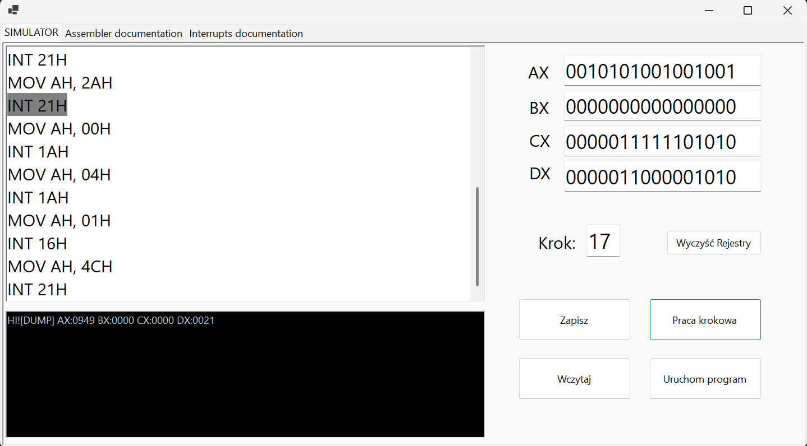
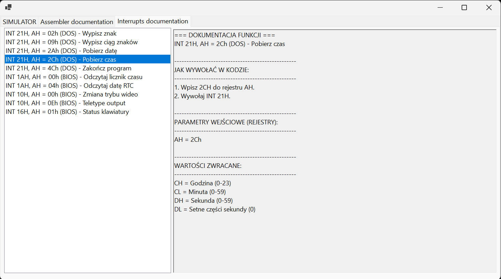

# 8086 Microprocessor Simulator

Application emulates developed using **.NET Windows Forms (C#)** selected aspects of the Intel 8086 architecture, allowing users to execute assembly-like programs, observe register changes in real time, and learn the fundamentals of low-level programming through integrated documentation modules.

## Features

* **8086 Register Simulation**:
    * Four 16-bit general-purpose registers: `AX`, `BX`, `CX`, and `DX`.
    * Support for accessing both full 16-bit registers and their 8-bit parts (`AH/AL`, `BH/BL`, `CH/CL`, `DH/DL`).
    * Real-time visualization of register contents using 16-bit binary representations.

* **Assembler Instruction Execution**:
    * Support for fundamental assembly instructions:
        * `MOV` – data transfer,
        * `ADD` – arithmetic addition,
        * `SUB` – arithmetic subtraction,
        * `PUSH` – push value onto the stack,
        * `POP` – retrieve value from the stack,
        * `INT` – software interrupt invocation.
    * Register and immediate addressing modes.

* **Multiple Number Formats**:
    * Decimal values (e.g., `25`)
    * Hexadecimal values with suffix or prefix notation (e.g., `10H`, `0x10`)
    * Binary values using the `B` suffix (e.g., `10101010B`)

* **Program Execution Modes**:
    * **Continuous Mode** – executes the entire program automatically.
    * **Step-by-Step Mode** – executes one instruction at a time with visual highlighting of the currently processed line, simplifying debugging and learning.

* **Internal Stack Simulation**:
    * Stack operations implemented using an internal stack structure.
    * Safe handling of invalid operations such as attempting to pop from an empty stack.

* **BIOS and DOS Interrupt Simulation**:
    * Partial implementation of selected interrupt services:
        * `INT 21H` (DOS services),
        * `INT 1AH` (RTC clock services),
        * `INT 10H` (video services),
        * `INT 16H` (keyboard services).
    * Output console integration for displaying interrupt results.

* **Integrated Educational Documentation**:
    * Built-in instruction reference describing syntax and usage examples.
    * Dedicated interrupt documentation explaining parameters and return values.
    * Designed as both a simulator and a teaching aid for introductory assembly programming courses.

---

## Preview

| Main Simulator Window | Interrupt Documentation |
| :---: | :---: |
<br>*Code editor, register visualization and output console.* | <br>*Integrated reference describing available interrupt services and their usage.* |

---

## System Requirements

To compile and run the project, you will need:

* Operating System: **Windows 10 / 11**
* Runtime Environment: **.NET 6.0 SDK** or newer
* IDE: **Visual Studio 2022** (recommended) or **JetBrains Rider**

---

## Download and Run

### Running via Visual Studio

1. Open the solution file in Visual Studio 2022.
2. Restore all required dependencies.
3. Set the simulator project as the startup project.
4. Press **F5** (or click *Start*) to build and launch the application.

### Running via Command Line Interface (CLI)

Navigate to the project directory and execute:

```bash
dotnet restore
dotnet run
```

---

## Supported Instructions

| Instruction | Description |
| :--- | :--- |
| `MOV` | Copies data between registers or from an immediate value. |
| `ADD` | Adds a value to the destination register. |
| `SUB` | Subtracts a value from the destination register. |
| `PUSH` | Stores a value on the internal stack. |
| `POP` | Restores a value from the internal stack. |
| `INT` | Invokes a simulated BIOS or DOS interrupt service. |

---

## Supported Interrupts

### DOS Interrupts (`INT 21H`)

| AH Value | Function |
| :--- | :--- |
| `02H` | Display a single character from register `DL`. |
| `09H` | Display a dump of all register values. |
| `2AH` | Retrieve the current system date. |
| `2CH` | Retrieve the current system time. |
| `4CH` | Terminate program execution. |

### BIOS Interrupts

#### `INT 1AH` – Real-Time Clock

| AH Value | Function |
| :--- | :--- |
| `00H` | Retrieve the number of timer ticks since midnight. |
| `04H` | Retrieve the current RTC date. |

#### `INT 10H` – Video Services

| AH Value | Function |
| :--- | :--- |
| `00H` | Clear the simulator output console. |
| `0EH` | Display a character using teletype output. |

#### `INT 16H` – Keyboard Services

| AH Value | Function |
| :--- | :--- |
| `01H` | Check keyboard status. |

---

## Project File Structure

```text
8086MicroprocessorSimulator/
├── docs/                         # Project documentation and screenshots
├── Form1.cs                      # Main simulator logic and event handlers
├── Form1.Designer.cs             # Windows Forms UI definition
├── Program.cs                    # Application entry point
├── report.pdf                    # Project report and technical documentation
├── README.md                     # Project documentation
├── *.csproj                      # C# project file
└── *.sln                         # Visual Studio solution
```